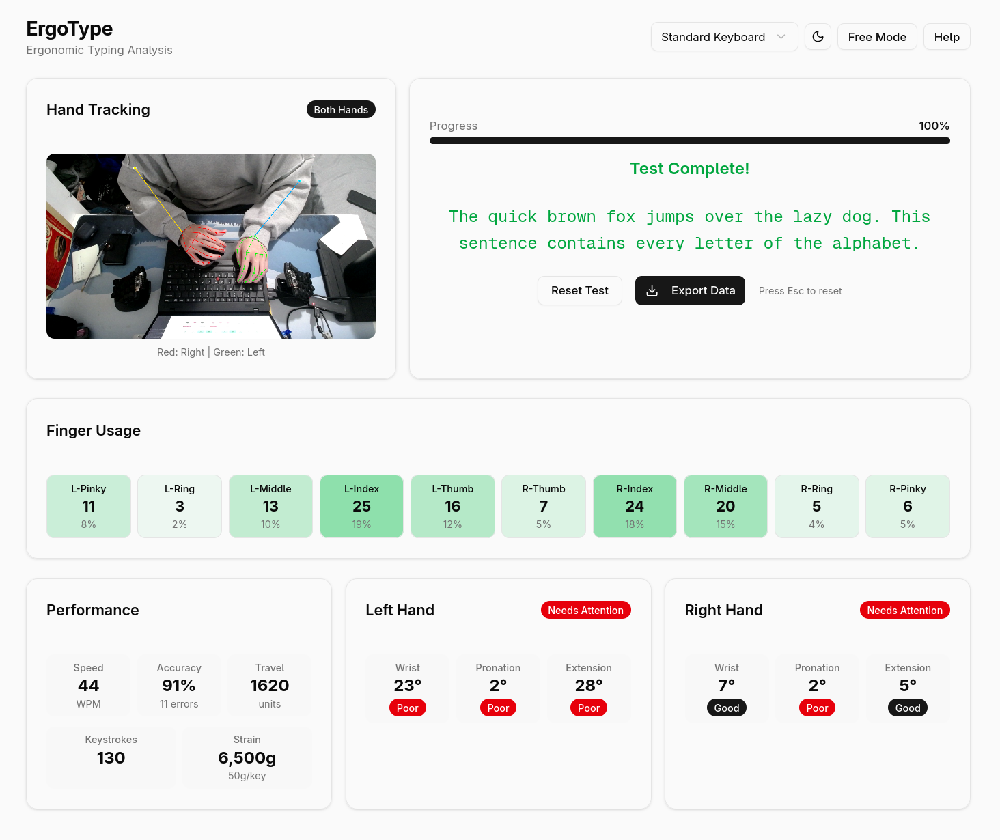

# ErgoType

A browser-based typing ergonomics measurement system that tracks wrist posture and typing biomechanics in real-time using only a standard webcam.

**[Live Demo](https://split-kbd.vercel.app/)**



## Overview

ErgoType enables quantitative comparison between traditional and ergonomic keyboard configurations by measuring wrist posture, finger movement, and cumulative physical strain. The system uses Google's MediaPipe for hand and pose tracking, running entirely client-side in the browser with no installation required.

## Features

- **Real-time hand tracking** using MediaPipe Hands (21 landmarks per hand)
- **Forearm tracking** using MediaPipe Pose for accurate wrist angle measurement
- **Six ergonomic metrics** with live visual feedback
- **Per-keystroke data logging** with exportable JSON
- **Typing test mode** with WPM and accuracy tracking
- **Free mode** for posture monitoring during regular work
- **Personalized recommendations** based on your typing posture

## Ergonomic Metrics

| Metric | Description | Good Range |
|--------|-------------|------------|
| **Wrist Deviation** | Ulnar/radial bending (side-to-side) | ≤10° |
| **Pronation** | Forearm rotation (palm down/up) | 35-55° |
| **Extension** | Wrist bend (up/down) | ≤5° |
| **Finger Travel** | Cumulative fingertip movement distance | Lower is better |
| **Cumulative Strain** | Keystrokes × actuation force (grams) | Lower is better |
| **Finger Usage** | Distribution across all 10 fingers | Balanced |

## How It Works

1. **Camera Setup**: Position your webcam to capture both hands and forearms (45° above keyboard recommended)
2. **Calibration**: The system automatically captures your neutral wrist position when the test begins
3. **Tracking**: MediaPipe detects hand and pose landmarks at ~30fps
4. **Smoothing**: 5-frame median filter for pose, 7-frame for angles, with outlier rejection
5. **Measurement**: Angles calculated from forearm and hand vectors in real-time

### Signal Processing Pipeline

- **Pose Smoothing**: 5-frame median filter for elbow/wrist positions
- **Angle Smoothing**: 7-frame median filter (~230ms at 30fps)
- **Outlier Rejection**: Frames with >0.15 normalized position jump are discarded
- **Baseline Calibration**: Neutral position captured after tracking stabilizes

## Technology Stack

- **Framework**: Next.js 14 with React and TypeScript
- **Computer Vision**: MediaPipe Hands & Pose (client-side)
- **UI**: Tailwind CSS with shadcn/ui components
- **Processing**: All computation runs in-browser (no server required)

## Getting Started

### Prerequisites

- Node.js 18+
- Modern browser with webcam access (Chrome, Firefox, Edge)
- Webcam positioned to see hands and forearms

### Installation

```bash
# Clone the repository
git clone https://github.com/yubelgg/split_kbd
cd split_kbd

# Install dependencies
npm install

# Start development server
npm run dev
```

Open [http://localhost:3000](http://localhost:3000) in your browser.

### Usage

1. **Allow camera access** when prompted
2. **Position camera** so both hands and forearms are visible
3. **Select keyboard type** to set actuation force for strain calculation
4. **Click "Start Test"** to begin the typing test
5. **Type the displayed text** while monitoring your posture metrics
6. **Review results** and personalized recommendations after completing

## Keyboard Presets

| Keyboard Type | Actuation Force |
|---------------|-----------------|
| Standard Keyboard | 50g |
| Cherry MX Brown/Red | 45g |
| Gateron Yellow | 50g |
| Kailh Choc Pink | 20g |

## Data Export

After completing a typing test, you can export session data as JSON including:
- All keystrokes with timestamps
- Per-keystroke wrist angles (deviation, pronation, extension)
- Finger usage distribution
- WPM and accuracy metrics
- Cumulative strain calculations

## Research Background

ErgoType is based on established ergonomic guidelines:

- **Wrist deviation** should ideally be <10° to prevent carpal tunnel syndrome
- **Forearm pronation** of ~45° (35-55° range) reduces strain on forearm muscles
- **Wrist extension** increases carpal tunnel pressure; keep near neutral

Split ergonomic keyboards address these issues through:
- Separated halves for reduced ulnar deviation
- Tenting to reduce pronation
- Columnar layouts for natural finger movement
- Lower actuation switches to reduce cumulative strain

## Limitations

- Requires good lighting for accurate hand tracking
- Camera positioning affects measurement accuracy
- Finger detection uses hybrid approach (vision + QWERTY fallback)
- Single-user validation; not yet tested across diverse populations

## License

MIT

## Acknowledgments

- [MediaPipe](https://mediapipe.dev/) for hand and pose tracking
- [shadcn/ui](https://ui.shadcn.com/) for UI components
- Ergonomic guidelines from Marklin & Simoneau (2004) and Rempel (2008)
